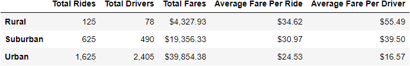
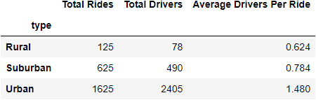
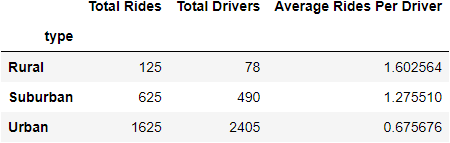
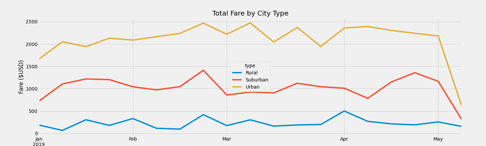

# Pyber Analysis

## Analysis Overview

In this analysis, it was requested that I analyze the data provided based on city type, and what the differences are. Based on my findings, I have a few suggestions on some things that might help PyBer increase their earnings over the next few months. The data is categorized by city type and analyzed by a list of criteria including:

- Total Rides (%)
- Total Drivers (%)
- Total Fares ($)
- Total fare based on city type
- Average total per ride
- Average total per driver

I've created a few visualizations that might help.

## Analysis Results

Based on my first analysis, we can see that Pyber generates a much larger revenue at a lower fare per driver in Urban areas. This is due to the amount of drivers and total rides in the Urban areas. While this is great for Pyber, it might not benefit the drivers as much. There are more drivers than rides to go around. 

I've created a visualization on each of those evaluations. We can see why drivers in Rural communities might generate a larger average income because they are accepting more rides per driver. Drivers in Urban communities accept less than one ride per day, while drivers in Rural communities accept around 1.6 rides per day on average. 

When comparing the three city types, average fare per ride seems to decrease in more urban and suburban communities, when compared to rural communities. And while Urban commities generate more total fares when compared to rural and suburban communities, Pyber's drivers aren't generating nearly as much income as drivers in the rural, and suburban communities. 

Pyber itself is best utilized by riders in Urban communities as we can see by the line chart below. Urban communities might have more availibility to making ride-share a suitable option for most residents. 

If PyBer were to explore more Urban communities, it would be benifical to not only drivers, but also PyBer as a company. PyBer has more opportunity to geneter more revenue in these communities. 
## Analysis Summary 

For Pyber to improve opportunities for drivers, it would be smart to move some of the drivers to less densely populated areas. By this, I mean that since Urban communities have so many drivers and not as many rides, move some drivers to the suburban communities. This will help Pyber's drivers average nearly all the same amount.

To improve total revenue, it would be smart for Pyber to move some more drivers into suburban communities more than rural. Rural areas have less residents on average according to the US census. PyBer may be able to increase total rides in these areas by making themselves more available to consumers. 

When considering affordability for riders, which was also one of PyBer's concern, the average cost per ride in Rural areas seems a bit extreme. Most residents in rural areas have an income that meets or is below the federal poverty line. Providing affordable ride-share options to residents who generate a lower income would be a smart move to increase total revenue in rural areas. If ride-share is more accessible, Pyber with generate more rides, thus generating a larger income in those areas. 

